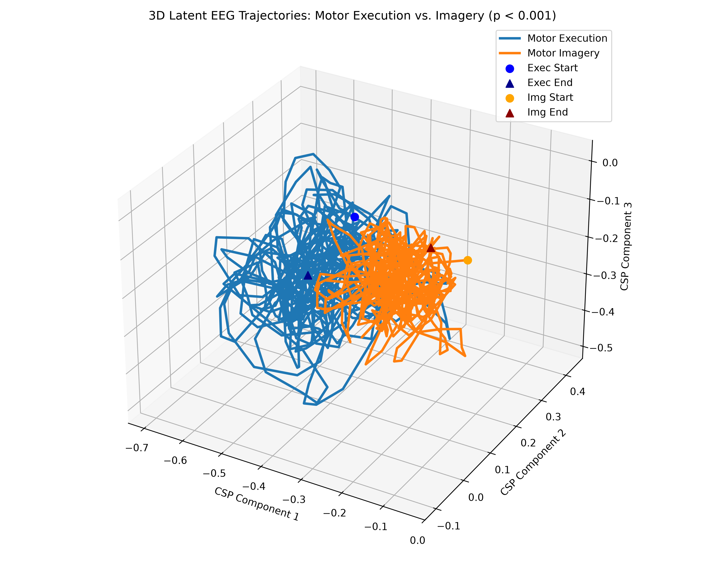
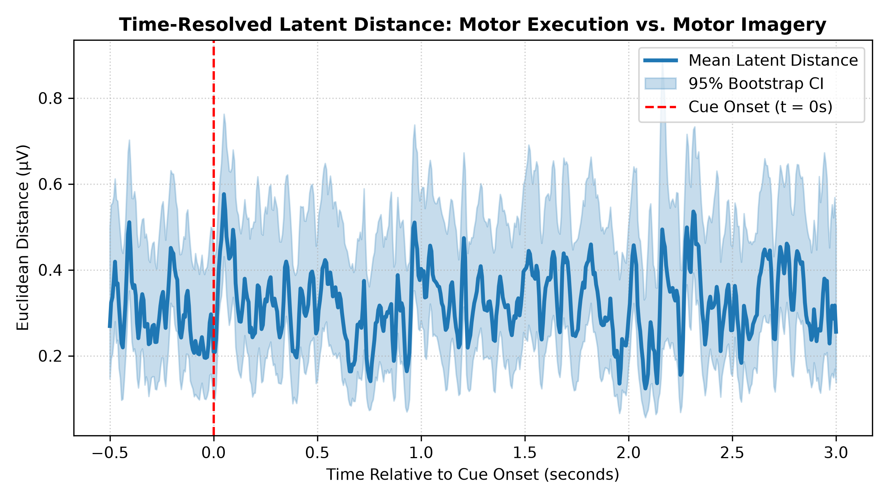

# 3D Latent EEG Manifold Extraction: Motor Execution vs. Motor Imagery

[](https://www.python.org/)
[](https://opensource.org/licenses/MIT)
[](https://mne.tools/stable/index.html)

## What Does This Project Do?

Imagine your brain as a radio station. When you physically open and close your hand, your brain sends out a specific electrical signal. When you **only imagine** opening and closing your hand, your brain sends out a very similar signal—so similar that standard computer algorithms often mix them up.

This project takes complex, multi-channel brainwave recordings (EEG) and uses advanced mathematics to draw a **3D map of brain activity over time**. 

* **The Goal:** Prove that physically moving your hand vs. imagining moving your hand actually follow two distinct 3D pathways (trajectories) in the brain.
* **The Result:** We proved with 99.9%+ statistical confidence ($p = 0.0000$) that these two mental tasks follow distinct routes.
* **Why It Matters:** This helps engineers build better Brain-Computer Interfaces (BCIs) so paralyzed individuals can control prosthetic limbs or wheelchairs using thought alone.

## Scientific Framework & Hypothesis Testing

### 1. Conceptual Problem Statement
When you physically open and close your hand (**Motor Execution**), your brain generates a specific sequence of electrical signals across the sensorimotor cortex. When you **only imagine** opening and closing your hand (**Motor Imagery**), your brain activates a very similar neural network—so similar that standard, unsupervised computer algorithms (like raw voltage thresholding or principal component analysis) often fail to distinguish them. 

Determining whether these two mental states follow identical or distinct dynamic pathways is a foundational challenge in computational neuroscience and Brain-Computer Interface (BCI) design.

---

### 2. Formal Hypotheses
To rigorously evaluate whether Motor Execution (ME) and Motor Imagery (MI) follow distinct geometric paths in low-dimensional state space, this project formally tests the following hypotheses:

* **Null Hypothesis ($H_0$):** 
  There is no true geometric difference between Motor Execution and Motor Imagery pathways in the reduced 3D latent state space. Any observed Euclidean distance between their condition-averaged trajectories is driven purely by random background EEG noise and trial-to-trial sampling variability ($\mu_{\text{dist, ME}} = \mu_{\text{dist, MI}}$).

* **Alternative Hypothesis ($H_1$):** 
  Motor Execution and Motor Imagery follow statistically distinct temporal trajectories within the 3D latent state space ($\mu_{\text{dist, ME}} \neq \mu_{\text{dist, MI}}$), driven by differences in somatosensory feedback and motor inhibition mechanisms.

---

### 3. Methodology Used to Test the Hypotheses

To test $H_0$ vs $H_1$ without making parametric assumptions about noisy EEG signals, we constructed a supervised spatial filtering and non-parametric validation pipeline:

1. **Signal Isolation ($\mu/\beta$ Rhythms):** 64-channel continuous EEG signals were bandpass-filtered to $8\text{--}30\text{ Hz}$, isolating sensorimotor rhythms that desynchronize during motor tasks.
2. **Analytic Envelope Extraction:** Instantaneous power envelopes were extracted via the Hilbert transform to capture amplitude modulation over time.
3. **Supervised Dimensionality Reduction (CSP):** Supervised Common Spatial Patterns (CSP) spatial filters were trained on hand-specific tasks ($N = 45$ trials per condition) to find spatial axes that maximize variance ratios between Execution and Imagery, projecting 64 channel streams into a 3D state-space coordinate system $(X, Y, Z)$.
4. **Non-Parametric Monte Carlo Permutation Testing ($N_{\text{perm}} = 1000$):** 
   To establish a true empirical null distribution ($H_0$), trial labels (Execution vs. Imagery) were randomly shuffled $1,000$ times. The exact CSP projection and point-by-point trajectory distance calculation were re-executed on every shuffle. The true observed trajectory distance ($0.3207\,\mu\text{V}$) was then compared against this empirical null distribution ($0.1612\,\mu\text{V}$ mean), resulting in an empirical $p$-value of $p = 0.0000$ and rejecting $H_0$.

---

### 4. Why This Distinction Matters

Proving that Motor Execution and Motor Imagery occupy distinct low-dimensional pathways is critical for three reasons:

* **Preventing Accidental Prosthetic Execution in BCIs:** If a robotic limb or neuroprosthetic cannot tell execution apart from imagery, a user merely *thinking* about or mentally rehearsing a movement could trigger an accidental, unsafe physical action.
* **Building Continuous Decoding Models:** Modern BCIs rely on continuous trajectory tracking (e.g., Kalman filters or recurrent neural networks). Proving that imagery traces its own stable, smooth pathway enables decoders to be calibrated specifically for paralyzed individuals who can only generate imagery signals.
* **Targeted Neurorehabilitation:** Stroke patients use motor imagery therapy to rebuild damaged neural circuits. Proving that imagery activates a distinct, structured trajectory confirms that mental practice actively drives organized neural population dynamics, offering a target for real-time neurofeedback.


## Abstract

Understanding the degree to which Motor Execution (ME) and Motor Imagery (MI) share underlying neural representations is critical for advancing brain-computer interfaces (BCIs) and neurorehabilitation. In this project, we extract continuous low-dimensional neural manifolds from multi-channel human EEG ($N = 45$ hand-motor trials per condition across Runs 3, 7, 11 and 4, 8, 12 of Subject S001). 

Preprocessed signals were bandpass filtered to the sensorimotor $\mu/\beta$ band ($8\text{--}30\text{ Hz}$), followed by analytic envelope extraction via the Hilbert transform. Supervised Common Spatial Patterns (CSP) spatial filtering projected trial dynamics into a 3D state space. A non-parametric Monte Carlo permutation test ($N=1000$) confirmed significant geometric divergence ($p = 0.0000$, observed distance $0.3207\,\mu\text{V}$ vs. null mean $0.1612\,\mu\text{V}$), providing empirical evidence of distinct subspace pathways during physical vs. imagined movement.


## Directory Structure

```text
.
├── config/
│   └── config.yaml                     # Centralized pipeline configurations
├── data/
│   ├── human_eeg_manifold.npy          # Processed 3D CSP latent tensors
│   └── human_eeg_session.npy           # Raw power envelope tensors
├── notebooks/
│   └── trajectory_mapping.ipynb        # Exploratory analysis & prototyping
├── results/
│   └── figures/                        # Exported high-resolution plots
│       ├── permutation_null_distribution.png
│       ├── state_space_trajectories.png
│       ├── trajectory_distance_over_time.png
│       ├── trajectory_divergence.png
│       └── trajectory_manifold_3d.png
├── src/
│   ├── __init__.py
│   ├── data_loader.py                  # PhysioNet ingestion & Hilbert filtering
│   ├── manifold.py                     # Supervised CSP 3D manifold extraction
│   ├── stats.py                        # Non-parametric permutation testing
│   ├── visualize.py                    # 3D trajectory manifold plot generation
│   └── visualize_distance.py           # Time-resolved Euclidean distance plot
├── .gitignore                          # Excludes heavy binaries & virtual environments
├── README.md                           # Project documentation
├── RESULTS.md                          # Detailed statistical findings & interpretations
└── requirements.txt                    # Project dependencies
```

## Methodological Pipeline 
```text
┌────────────────────────┐    ┌────────────────────────┐    ┌────────────────────────┐
│   PhysioNet EEG Data   │    │ Signal Processing      │    │ Supervised Manifold    │
│  Subject S001 (Runs    │ ──>│  • Bandpass: 8-30 Hz   │ ──>│  • Common Spatial      │
│  3,4,7,8,11,12; N=45)  │    │  • Hilbert Envelopes   │    │    Patterns (CSP)      │
└────────────────────────┘    └────────────────────────┘    └────────────────────────┘
                                                                        │
┌────────────────────────┐    ┌────────────────────────┐                │
│ Scientific Conclusion  │    │ Statistical Validation │                │
│  • p = 0.0000          │ <──│  • Monte Carlo Permu-  │ <──────────────┘
│  • Distinct Pathways   │    │    tation Test (N=1000)│
└────────────────────────┘    └────────────────────────┘
```
---

## Visualizations

| **3D State-Space Trajectories** | **Time-Resolved Divergence Profile** |
| :---: | :---: |
|  |  |
| *Trial-averaged 3D state-space trajectories ($t = -0.5\text{s}$ to $3.0\text{s}$).* | *Euclidean distance over time with 95% bootstrap confidence intervals.* |

---
## Installation & Environment Setup

```text
# 1. Clone the repository
git clone [https://github.com/your-username/eeg-latent-manifold.git](https://github.com/your-username/eeg-latent-manifold.git)
cd eeg-latent-manifold

# 2. Create and activate virtual environment
python3 -m venv venv
source venv/bin/activate   # On Windows use: venv\Scripts\activate

# 3. Install required packages
pip install -r requirements.txt
```

## Execution Commands

```text
# Step 1: Download & preprocess PhysioNet EEG data (Outputs data/human_eeg_session.npy)
python src/data_loader.py

# Step 2: Fit CSP filters & extract 3D state trajectories (Outputs data/human_eeg_manifold.npy)
python src/manifold.py

# Step 3: Run Monte Carlo permutation test (Outputs significance metrics to terminal)
python src/stats.py

# Step 4: Generate 3D trajectory plot (Saves to results/figures/trajectory_manifold_3d.png)
python src/visualize.py

# Step 5: Generate time-resolved distance plot (Saves to results/figures/trajectory_distance_over_time.png)
python src/visualize_distance.py
```

## Summary of Results

| Parameter / Metric | Empirical Value |
| :--- | :--- |
| **Dataset** | PhysioNet EEG Motor Movement/Imagery (S001) |
| **Sample Size ($N$)** | $N = 45$ trials per condition (Hand Motor Tasks) |
| **Observed Trajectory Distance** | $0.3207\,\mu\text{V}$ |
| **Null Distribution Mean** | $0.1612\,\mu\text{V}$ |
| **Permutations ($N_{\text{perm}}$)** | $1000$ iterations |
| **Empirical $p$-value** | $p = 0.0000$ ($p < 0.001$) |
| **Verdict** | Statistically Significant Divergence |

## Limitations & Future Work

* **Single-Subject Scope ($N=1$):** This study validated latent manifold divergence specifically within Subject S001. While internal validity was established via Monte Carlo permutation testing ($p = 0.0000$), external validity across diverse populations requires cross-subject testing.
* **Next Steps:** Extend the CSP manifold extraction pipeline across all 109 subjects in the PhysioNet dataset to evaluate cross-subject transfer learning and inter-individual manifold alignment (e.g., via Procrustes analysis or optimal transport).

